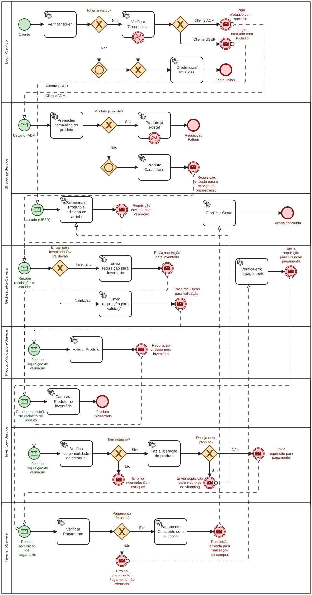

# 🛒 Work Shopping Microservices

Sistema de e-commerce desenvolvido com arquitetura de microsserviços, focado em escalabilidade, desacoplamento entre serviços e facilidade de manutenção.

O projeto foi criado com o objetivo de demonstrar conceitos modernos de desenvolvimento backend distribuído, integração entre serviços e utilização de boas práticas de arquitetura.

---

# 📚 Sumário

* [Sobre o Projeto](#-sobre-o-projeto)
* [Visualização do Processo BPMN](#-visualização-do-processo-bpmn)
* [Tecnologias Utilizadas](#-tecnologias-utilizadas)
* [Estrutura do Projeto](#-estrutura-do-projeto)
* [Microsserviços](#-microsserviços)
* [Pré-requisitos](#-pré-requisitos)
* [Como Executar o Projeto](#-como-executar-o-projeto)
* [Docker](#-docker)
* [Endpoints](#-endpoints)
* [Boas Práticas Aplicadas](#-boas-práticas-aplicadas)
* [Melhorias Futuras](#-melhorias-futuras)
* [Autor](#-autor)

---

# 📖 Sobre o Projeto

O **Work Shopping Microservices** é uma aplicação baseada em microsserviços voltada para um cenário de marketplace/e-commerce.

A proposta da aplicação é separar responsabilidades em serviços independentes, permitindo:

* Escalabilidade horizontal;
* Facilidade de manutenção;
* Resiliência;
* Melhor organização do domínio;
* Comunicação desacoplada entre serviços.

O projeto segue conceitos de arquitetura distribuída e pode ser utilizado como base de estudos para:

* Microsserviços;
* Docker;
* APIs REST;
* Mensageria;
* Observabilidade.

---

# 🗺️ Visualização do Processo BPMN

Abaixo está a representação visual do fluxo de negócio desenhado para esta arquitetura:

<p align="center">
  
</p>

---
## Características da arquitetura

* Serviços independentes;
* Banco de dados por serviço;
* Comunicação desacoplada;
* Containerização com Docker;
* Escalabilidade horizontal;
* Separação por domínio.

---

# 🚀 Tecnologias Utilizadas

## Backend

* Java
* Spring Boot
* Spring Data JPA
* Maven

## Banco de Dados

* PostgreSQL
* MongoDB

## Infraestrutura

* Docker
* Docker Compose

## Comunicação

* REST APIs

## Ferramentas

* Git
* GitHub
* Postman
* Swagger / OpenAPI

---

# 📂 Estrutura do Projeto

```text
work-shopping-microsservices/
│
├── product-service/
├── order-service/
├── payment-service/
├── docker-compose.yml
├── processo.bpmn
├── processo.svg
└── README.md
```

---

# 🔧 Microsserviços

## 📦 Product Service

Responsável por:

* Cadastro de produtos;
* Consulta de catálogo;
* Controle de estoque.

---

## 🛍 Order Service

Responsável por:

* Criação de pedidos;
* Processamento de compras;
* Integração entre serviços.

---

## 💳 Payment Service

Responsável por:

* Processamento de pagamentos;
* Validação de transações;
* Status de pagamento.

---

# 📋 Pré-requisitos

Antes de executar o projeto, você precisa ter instalado:

* Docker
* Docker Compose
* Java 17+
* Maven
* Git

---

# ▶️ Como Executar o Projeto

## 1. Clone o repositório

```bash
git clone https://github.com/RavikFerreira/work-shopping-microsservices.git
```

## 2. Acesse a pasta do projeto

```bash
cd work-shopping-microsservices
```

## 3. Execute os containers

```bash
docker-compose up --build
```

## 4. Acesse os serviços

| Serviço         | Porta |
| --------------- | ----: |
| Product Service |  8081 |
| Order Service   |  8082 |
| Payment Service |  8084 |

---

# 🐳 Docker

O projeto utiliza Docker para facilitar:

* Ambiente padronizado;
* Deploy;
* Escalabilidade;
* Isolamento dos serviços.

Para subir todos os serviços:

```bash
docker-compose up -d
```

Para derrubar os containers:

```bash
docker-compose down
```

---

# 🔌 Endpoints

## Produtos

```http
GET /products
POST /products
GET /products/{id}
```

## Pedidos

```http
POST /orders
GET /orders/{id}
```

---

# 📑 Documentação da API

A documentação pode ser acessada via Swagger:

```text
http://localhost:8081/swagger-ui.html
```

---

# ✅ Boas Práticas Aplicadas

* SOLID;
* Clean Architecture;
* Separação de responsabilidades;
* Database per Service;
* Resiliência entre serviços;
* Containers independentes.

---

# 📈 Melhorias Futuras

* Implementação de CI/CD;
* Observabilidade com Prometheus e Grafana;
* Tracing distribuído;
* Kubernetes;
* Testes automatizados;
* Circuit Breaker;
* Cache distribuído;
* Deploy em cloud.

---

# 👨‍💻 Autor

Desenvolvido por Ravik Ferreira.

**GitHub:**
[RavikFerreira GitHub](https://github.com/RavikFerreira)

**Projeto:**
[Work Shopping Microsservices Repository](https://github.com/RavikFerreira/work-shopping-microsservices)

---

# ⭐ Contribuição

Contribuições são sempre bem-vindas.

Para contribuir:

1. Faça um fork do projeto;
2. Crie uma branch:

```bash
git checkout -b feature/minha-feature
```

3. Faça o commit:

```bash
git commit -m "feat: minha nova feature"
```

4. Faça push:

```bash
git push origin feature/minha-feature
```

5. Abra um Pull Request.

---

# 📄 Licença

Este projeto está sob a licença MIT.

